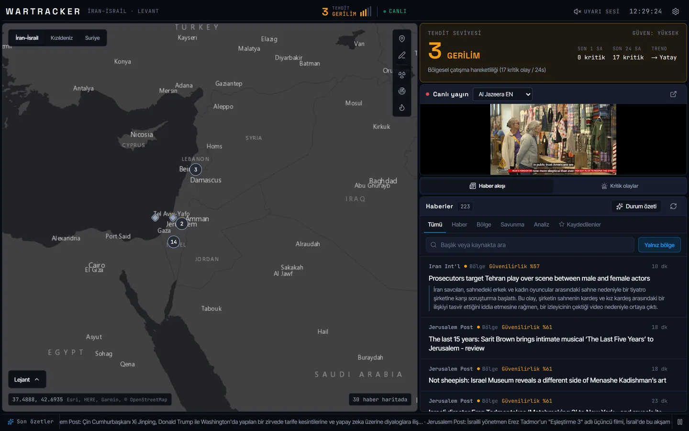
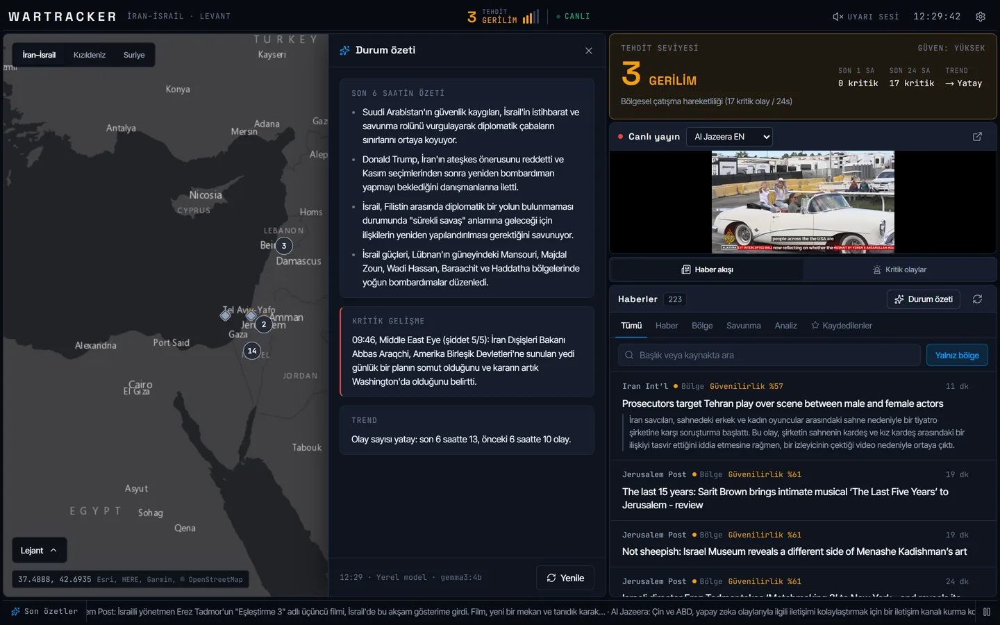
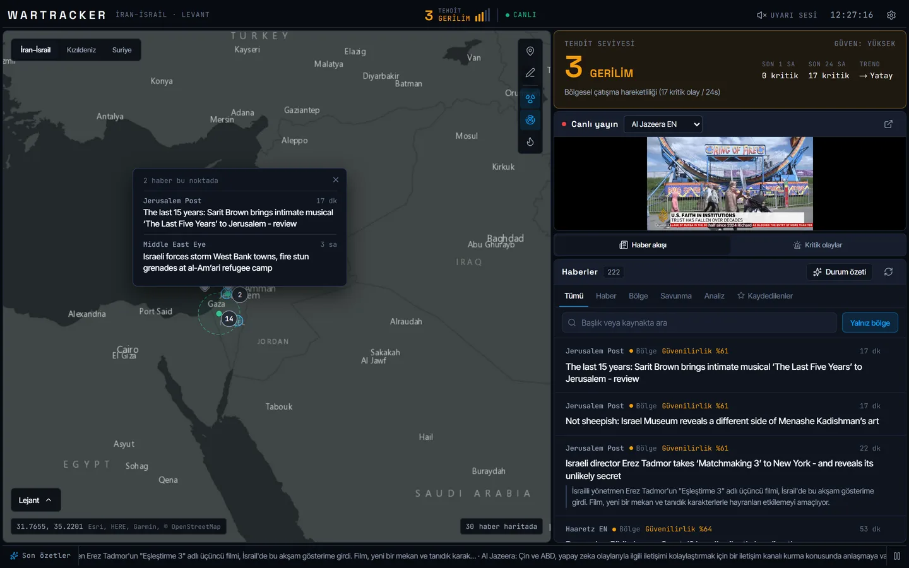
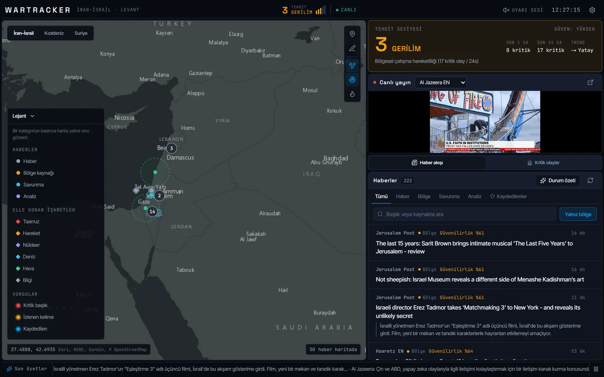
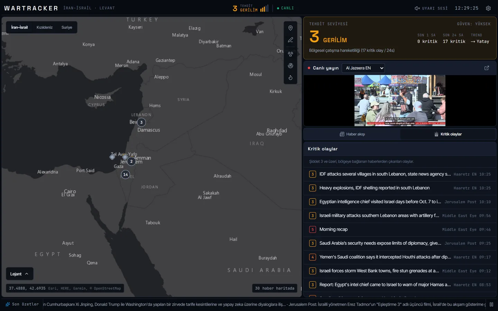
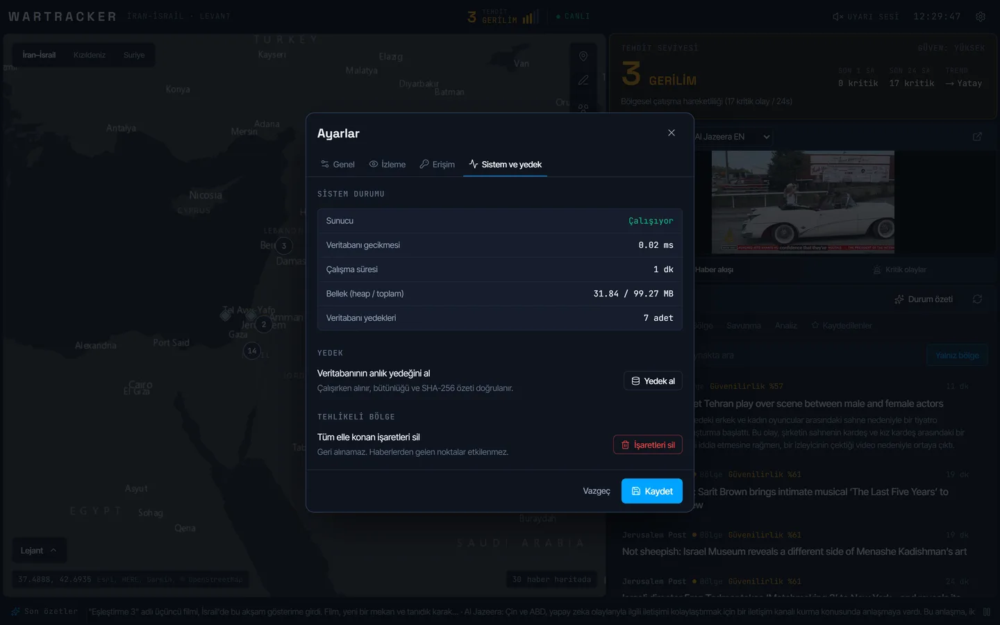
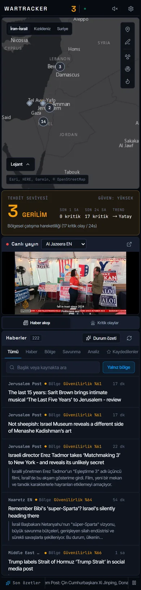

# Wartrack

**Açık kaynak haber akışlarını haritaya bağlayan, olayları puanlayan ve Türkçe durum özeti üreten
tek operatörlük bölgesel izleme panosu.**

Bir kriz masasındaki analist her sabah aynı soruyu sorar: *"İran–İsrail hattında son bir saatte yeni
bir kritik gelişme var mı, ve haritada nerede yoğunlaşıyor?"* Wartrack 15 uluslararası ve bölgesel
kaynağı düzenli tarar, haberleri bir yer adları sözlüğüyle haritaya yerleştirir, şiddet puanı taşıyan
olaylara çevirir ve bunlardan **açıklanabilir** bir tehdit seviyesi hesaplar: panel yalnız "3 · GERİLİM"
demez, bu seviyeyi hangi ölçümün belirlediğini de yazar. Haberler yerel bir dil modeliyle Türkçe
özetlenir; veri makineden çıkmaz.



## Ne yapar

| | |
|---|---|
| **Kaynak toplama** | 15 RSS kaynağı (Al Jazeera, BBC, Guardian, Haaretz, Iran International, ISW…), her istekte SSRF denetimi, devre kesici, yeniden deneme ve süre sınırı. |
| **Haritaya bağlama** | Yer adları sözlüğü haberi bölgedeki bir noktaya yerleştirir; aynı noktaya düşen haberler tek işarette sayıyla toplanır. Bölgeye bağlanamayan haberler akışta varsayılan olarak gizlenir. |
| **Olay ve tehdit** | Bölgeye ait haberlerden şiddet 3+ olaylar çıkarılır ve yayın zamanıyla tarihlenir. Tehdit seviyesi (1–5) son 1/24 saatin kritik olay sayısından, 6 saatlik eğilimden, coğrafi dağılımdan ve çok kaynaklı teyit kümelerinden hesaplanır; her etken gerekçesiyle döner. |
| **Türkçe özet** | Her habere yerel modelle (Ollama, `gemma3:4b`) tek-iki cümlelik tarafsız özet. Dil denetiminden geçmeyen çıktı yazılmaz; model yoksa özet boş kalır, uydurma metinle doldurulmaz. |
| **Durum özeti** | Son 6 saatin maddeleri modelden; "Kritik gelişme" ve "Trend" bölümleri ise ölçümden (en yüksek şiddetli olay, olay sayıları) gelir. Model kapalıyken aynı yapı sayımlardan kurulur. |
| **Operatör araçları** | Elle işaret ve çizim, nükleer tesis ve hava savunma menzili katmanları, izlenen kelimeler, canlı yayın, Ctrl+K komut paleti, son 24 saatin Markdown durum raporu. |
| **İşletme** | Çalışırken veritabanı yedeği (bütünlük denetimi + SHA-256), geri yükleme runbook'u, teşhis ekranı, paylaşılan anahtarla yazma yetkisi. |

## Mimari

```
RSS (15) ──► SSRF denetimli çekme ──► normalize + yer adı ──► SQLite (WAL)
                                                 │
                         olay çıkarımı ◄─────────┤──────────► özet kuyruğu ──► Ollama / Gemini
                               │                                     │
                     tehdit motoru (açıklanabilir)          dil denetimi (TR)
                               │                                     │
                               └──────── Socket.IO canlı akış ───────┴──► React panosu
```

| Katman | Teknoloji |
|---|---|
| Frontend | React 18 · Vite 5 · TypeScript · Zustand · Leaflet (Esri Dark Gray) · lucide-react · Tailwind |
| Backend | Node.js · Express · Socket.IO · TypeScript · better-sqlite3 (WAL) · undici · node-cron |
| AI | Ollama `gemma3:4b` (yerel, varsayılan) · Gemini (isteğe bağlı bulut yedeği) |
| Kalite | Vitest (backend 242, frontend 54 test) · ESLint · `tsc` · Linux CI (GitHub Actions) · Lighthouse |

Güvenlik ayrıntısı [`docs/THREAT_MODEL.md`](docs/THREAT_MODEL.md), yedek ve geri yükleme
[`docs/DISASTER_RECOVERY_RUNBOOK.md`](docs/DISASTER_RECOVERY_RUNBOOK.md), olay birleştirme yöntemi
[`docs/CORROBORATION_METHODOLOGY.md`](docs/CORROBORATION_METHODOLOGY.md) içinde.

## Yapay zekâ ile nasıl geliştirildi

Wartrack tek geliştirici tarafından yapay zekâ kodlama ajanlarıyla eşli çalışılarak geliştirildi.
Yöntem, ajanın hızını yazılı sözleşmeler ve ölçümle dengelemek üzerine kurulu:

- **Tasarım sözleşmesi.** [`DESIGN.md`](DESIGN.md) brifi (cerrahi, sakin, taktiksel), token
  sistemini ve "anti-slop" yasaklarını tanımlar. Her arayüz turu dört ekran genişliğinde ekran
  görüntüsüyle doğrulanır ve [`design/decisions.md`](design/decisions.md)'ye yazılır.
- **Model seçimi ölçümle.** Yerel özet modeli gerçek haberler üzerinde kıyaslanarak seçildi:
  `llama3.2:3b` Türkçe özete İngilizce ve Çince sözcük karıştırdı, `gemma3:4b` temiz Türkçe ve ~2 sn.
- **Hesap kodun, metin modelin işi.** Tehdit seviyesi, kritik gelişme ve trend deterministik
  kodla hesaplanır; dil modeli yalnız haber metnini özetler. Model bir sayım hakkında yorum yapamaz.
- **Denetim.** Eylül 2026 denetiminde CI 5 haftadır kırmızıydı; testlerin canlı veritabanını
  sildiği, RSS'in yavaş DNS'te hiç haber çekemediği, harita katmanının ve 8 canlı yayından 4'ünün
  ölü olduğu, kural tabanlı yedeğin haberlerin altına kalıp cümleleri "AI özeti" diye yazdığı
  bulundu ve kapatıldı (her biri regresyon testiyle). Ayrıntı: [`DURUM.md`](DURUM.md).

## Kurulum

**Önkoşullar:** Node 22+ ve pnpm 10 · (isteğe bağlı) [Ollama](https://ollama.com)

```bash
pnpm --dir backend install
pnpm --dir frontend install

cp .env.example .env
# Güçlü bir paylaşılan anahtar üretip .env içindeki API_SHARED_SECRET'e yazın:
node -e "console.log(require('crypto').randomBytes(32).toString('hex'))"

# Türkçe özet ve durum özeti için (isteğe bağlı):
ollama pull gemma3:4b      # sonra .env: BRIEF_MODEL_ENABLED=1
```

Çalıştırma: Windows'ta `pnpm dev` (iki servisi birlikte açar); diğer sistemlerde iki terminalde
`pnpm dev:backend` ve `pnpm dev:frontend`. Pano `http://localhost:5173` adresinde açılır; aynı anahtarı
**Ayarlar › Erişim** bölümüne girin. Okuma işlemleri anahtarsız çalışır, yazma ve canlı akış anahtar ister.

## Komutlar

| Komut | Ne yapar |
|---|---|
| `pnpm --dir backend test:run` | Backend testleri (geçici veritabanıyla; canlı veriye dokunmaz) |
| `pnpm --dir frontend test:run` | Frontend birim ve store testleri |
| `pnpm --dir backend lint` · `pnpm --dir backend typecheck` | Statik analiz (frontend için aynı komutlar) |
| `pnpm --dir backend build` · `pnpm --dir backend migrate:check` | Derleme ve temiz veritabanında göç denetimi |
| `node .github/scripts/smoke.mjs` | Derlenmiş sunucuya gerçek HTTP ile duman testi |

## Durum

Tamamlanmış, tek operatörlük bir araç: CI yeşil, yukarıdaki bütün akışlar yerelde uçtan uca çalışıyor.
Bilinen sınırlar (bölge süzgecinin coğrafi olması, 4B yerel modelin ara sıra yer adı hatası, sabit
video kimliklerinin zamanla eskimesi) ve ölçümler [`DURUM.md`](DURUM.md) içinde.

## Ekranlar

| | |
|---|---|
|  |  |
|  |  |
|  |  |

Haberler ve olaylar gerçek kamuya açık kaynaklardan otomatik toplanmıştır; özetler yerel modelin çıktısıdır.

---

MIT Lisansı · © 2026 Berkay Karaca (Scryne)
