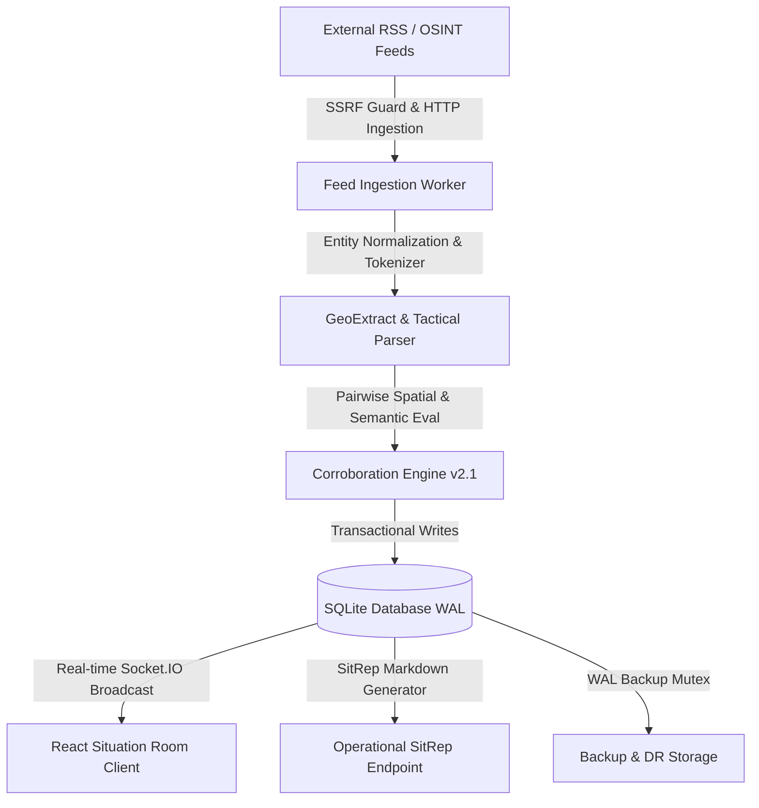

# WARTRACKER — SYSTEM ARCHITECTURE SPECIFICATION

## 1. Architectural Overview

WARTRACKER is an event-driven tactical OSINT processing platform designed for situation room operations. The system continuously polls open-source intelligence feeds, extracts spatial and tactical tokens, corroborates concurrent reports into unified incident clusters, and streams live tactical telemetry to client maps and command feeds.

---

## 2. Component Subsystems

### 2.1 Network Ingestion Subsystem (`backend/src/services/feed.service.ts`)
- Scheduled cron tasks (`node-cron`) poll configured RSS/Atom endpoints at configurable intervals (default: 60s).
- Network safety enforced by `ssrfGuard.ts` checking IP addresses against private and metadata subnets before socket connection.
- XML payloads parsed via `fast-xml-parser` with defensive entity handling and ISO-8601 timestamp normalization.

### 2.2 Intelligence & Corroboration Subsystem (`backend/src/services/corroboration.service.ts`)
- Implements `v2.1-tactical` pairwise multi-signal corroboration.
- Combines Jaccard token similarity, Haversine geographic distance gates ($d \le 50\text{ km}$), temporal decay windows ($t \le 6\text{ hours}$), and contradiction detection rules.
- Aggregates primary wire agency sources (`wire:reuters`, `wire:ap`, `wire:afp`, `wire:aa`, `wire:sana`, `wire:tass`) to prevent syndicated false confidence.

### 2.3 Storage & Persistence Subsystem (`backend/src/db/`)
- Relational schema hosted on SQLite 3 with `better-sqlite3`.
- `PRAGMA journal_mode = WAL` allows concurrent readers and writers without lock blocking.
- Versioned migrations (`migrate.ts`) ensure schema evolvability and deterministic deployment.

### 2.4 Situation Room Client (`frontend/src/`)
- React 18 single-page application built with Vite and TypeScript.
- Real-time map rendering via Leaflet with custom tactical SVG markers and threat rings.
- Audio telemetry utilizing Web Audio API oscillators for tactical alert cues.
- State management via Zustand stores (`useFeedStore`, `useMapStore`, `useEventStore`, `useSettingsStore`).
